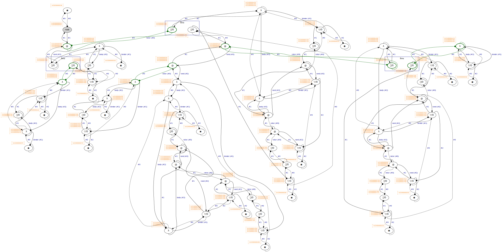

# 🔬 Optiscope

_Optiscope_ is a Lévy-optimal implementation of the pure lambda calculus enriched with native function calls, if-then-else expressions, & a fixed-point operator.

Being the first public implementation of [Lambdascope] [^lambdascope] written in portable C99, it is also the first interaction net reducer capable of calling user-provided functions at native speed. In potential, such a seemingly unnatural combination opens a new specialized programming paradigm suited for problems exhibiting both structural sharing & computational intensity.

[Lambdascope]: https://citeseerx.ist.psu.edu/document?repid=rep1&type=pdf&doi=61042374787bf6514706b49a5a4f0b74996979a0

In what follows, we briefly explaine what it means for reduction to be Lévy-optimal, & then describe our results.

_To every person to informe me of a semantic bug, I will pay $1000 in Bitcoin. More details [here](#bounty-policy)._

## On optimality

Following the classical example (here borrowed from [^lamping]):

```
((λg. (g (g (λx. x))))
 (λh. ((λf. (f (f (λz. z))))
       (λw. (h (w (λy. y)))))))
```

This term containes two redexes: the outer redex `((λg. ...) (λh. ...))` & the inner redex `((λf. ...) (λw. ...))`. If the outer redex is to be reduced first, which follows the normal order reduction strategy, the term will reduce in a single step to:

```
G := (λh. ((λf. (f (f (λz. z))))
          (λw. (h (w (λy. y))))))
(G (G (λx. x)))
```

which will cause duplication of the inner redex `((λf. ...) (λw. ...))`, thereby entailing duplication of work.

On the other hand, if we follow the applicative order strategy, then four instances of the redex `(h (w (λy. y)))` will need to be processed independently, again entailing duplication of work:

<details>
<summary>Show the full reduction</summary>

```
((λg. (g (g (λx. x))))
 (λh. ((λf. (f (f (λz. z))))
       (λw. <(h (w (λy. y)))>))))

↓ [f/F]

F := (λw. <(h (w (λy. y)))>)
((λg. (g (g (λx. x))))
 (λh. (F (F (λz. z)))))

↓ [(λz. z)/w]

((λg. (g (g (λx. x))))
 (λh. (F <(h ((λz. z) (λy. y)))>)))

↓ [(λy. y)/z]

((λg. (g (g (λx. x))))
 (λh. (F <(h (λy. y))>)))

↓ [<(h (λy. y))>/w]

((λg. (g (g (λx. x))))
 (λh. <(h (<(h (λy. y))> (λy. y)))>))

↓ [g/G]

G := (λh. <(h (<(h (λy. y))> (λy. y)))>)
(G (G (λx. x)))

↓ [(λx. x)/h]

(G <((λx. x) (<((λx. x) (λy. y))> (λy. y)))>)

↓ [(λy. y)/x]

(G <((λx. x) (<(λy. y)> (λy. y)))>)

↓ [(λy. y)/y]

(G <((λx. x) <(λy. y)>)>)

↓ [(λy. y)/x]

(G <<(λy. y)>>)

↓ [<<(λy. y)>>/h]

<(<<(λy. y)>> (<(<<(λy. y)>> (λy. y))> (λy. y)))>

↓ [(λy. y)/y]

<(<<(λy. y)>> (<<<(λy. y)>>> (λy. y)))>

↓ [(λy. y)/y]

<(<<(λy. y)>> <<<(λy. y)>>>)>

↓ [<<<(λy. y)>>>/y]

<<<<<<(λy. y)>>>>>>
```

</details>

In this case, the cause of redundant work is the _virtual redex_ `(h (w (λy. y)))`: when `w` & `h` are instantiated with their respective values, we obtaine the same term `((λy. y) (λy. y))`, which applicative order reduction is not able to detect.

A simpler example to illustrate the principle would be (taken from chapter 2 of [^optimal-implementation]):

```
once = (λv. v)
twice = (λw. (w w))
M = ((λx. x once) (λy. twice (y z)))
```

Proceeding with applicative order reduction:

```
((λx. x once) (λy. twice (y z)))

↓ [(y z)/w]

((λx. x once) (λy. (y z) (y z)))

↓ [(λy. (y z) (y z))/x]

((λy. (y z) (y z)) once)

↓ [once/y]

((once z) (once z))

↓ [z/v]

(z (once z))

↓ [z/v]

(z z)
```

Firstly, the (neutral) application `(y z)` is duplicated; however, later `y` is instantiated with `once`, which makes `(y z)` a redex. Thus, even if some application is not reducible at the moment, it may become reducible later on, so duplicating it would not be optimal. Ideally, both _explicit_ & _virtual_ redexes should be shared; applicative order shares onely explicit redexes, while normal order does not share any.

As also discussed in [^lamping] & [^optimal-implementation], the technique of graph reduction, sometimes termed _lazy evaluation_, is also not optimal: while it postpones copying the redex argument initially, it must copy a term participating in a redex, whenever the former happens to be shared. Consider the following term (adapted from section 2.1.1 of [^optimal-implementation]):

```
((λx. (x y) (x z)) (λw. ((λv. v) w)))
```

After the outermost reduction `((λx. ...) (λw. ...))` is complete, the two occurrences of `(λw. ((λv. v) w))` are now shared through the same parameter `x`. However, as this shared part is participating in both `((λw. ((λv. v) w)) y)` & `((λw. ((λv. v) w)) z)` simultaneously, it must be copied for the both redexes, lest substitution in either redex should affect the other one. In doing so, graph reduction also copies the redex `((λv. v) w)`, thereby duplicating work.

_Optimal evaluation_ (in Lévy's sense [^levy-thesis] [^levy-optimal-reductions]) is a technique of reducing lambda terms to their normal forms, in practice done through so-called _interaction nets_, which are graphs of special symbols & unconditionally local rewriting rules. To reduce a lambda term, an optimal evaluator (1) translates the term to an interaction net, (2) applies a number of interactions (rewritings) in a non-deterministic order, & (3) when no more rules can be applied, translates the resulting net back to the syntactical universe of the lambda calculus. Unlike the other discussed techniques, it performes no copying whatsoever, thereby achieving _maximal sharing_ of redexes.

In practice, this is how an interaction net looks like:

<div align="center">
  
</div>

(Green nodes are "active" nodes, i.e., those that interact with each other.)

Each edge has its own symbol: one of `@`, `λ`, `◉`, `▽/i`, `⌒/i`, or `S` (which appears later during read-back), where `i` is an unsigned "index" that can change during interaction. The first two symbols, `@` & `λ`, have the expected meaning; the other symbols are used for bookkeeping work. Among those, the most important one is `▽/i`, which shares a single piece of a graph between two other edges. Sharing edges can be nested arbitrarily deep, allowing for sharing of an arbitrary number of redexes.

For an evaluator to be optimal, it must satisfie the following properties:
 1. The normal form, if it exists, is alwaies reached.
 2. The normal form, if it exists, is reached in a _minimum number of beta reductions_.
 3. Redexes of the same origin are shared & reduced in a single step.
 4. No unneeded redexes are ever reduced.

Optiscope operates in **five discrete phases**: (1) weak reduction, (2) full reduction, (3) unwinding, (4) scope removal, & (5) loop cutting. The first two phases performe interaction net reduction; the latter phases read back the reduced net into a net that can be directly interpreted as a lambda calculus expression. Weak reduction achieves true Lévy-optimality by reducing onely _needed_ redexes (i.e., neither duplicating work nor touching redexes whose result will be discarded); the latter phases are to be understood as "extensions" that are not formally Lévy-optimal. In particular, although full reduction is guaranteed to reach beta normal forms, it is allowed to fire redexes whose result will be eventually discarded by subsequent computation. This choice is made of practical concerns, since implementing full Lévy-optimal reduction is neither easy, nor necessary; all functional machines in practice are weak anywaies.

Mathematically, our implementation follows the Lambdascope formalism [^lambdascope], which is perhaps the simplest (among many others) proposal to optimality, involving onely six types of nodes & three rule schemes. As here we make no attempt at giving optimality a formal treatment, an interested reader is invited to read the paper for more details & ask any related questions in the issues.

## Benchmarks

<details>
<summary>System information</summary>

```
                          ./+o+-       etiams@etiams
                  yyyyy- -yyyyyy+      OS: Ubuntu 24.04 noble
               ://+//////-yyyyyyo      Kernel: x86_64 Linux 6.8.0-60-generic
           .++ .:/++++++/-.+sss/`      Uptime: 16m
         .:++o:  /++++++++/:--:/-      Packages: 2799
        o:+o+:++.`..```.-/oo+++++/     Shell: bash 5.2.21
       .:+o:+o/.          `+sssoo+/    Resolution: 3840x2400
  .++/+:+oo+o:`             /sssooo.   DE: GNOME 46.7
 /+++//+:`oo+o               /::--:.   WM: Mutter
 \+/+o+++`o++o               ++////.   WM Theme: Adwaita
  .++.o+++oo+:`             /dddhhh.   GTK Theme: Yaru-red [GTK2/3]
       .+.o+oo:.          `oddhhhh+    Icon Theme: Yaru-red
        \+.++o+o``-````.:ohdhhhhh+     Font: Ubuntu Sans Bold 11 @wght=700
         `:o+++ `ohhhhhhhhyo++os:      Disk: 389G / 484G (85%)
           .o:`.syhhhhhhh/.oo++o`      CPU: AMD Ryzen 9 5900HX with Radeon Graphics @ 16x 4.68GHz
               /osyyyyyyo++ooo+++/     GPU: AMD/ATI Cezanne [Radeon Vega Series / Radeon Vega Mobile Series]
                   ````` +oo+++o\:     RAM: 5849MiB / 15388MiB
                          `oo++.
```

</details>

On GNU/Linux, you need to reserve huge pages as follows: `sudo sysctl vm.nr_hugepages=4096`.

### [Fibonacci of 30](benchmarks/fibonacci-of-30.c)

Description: Recursively computes the 30th Fibonacci number using the built-in fixpoint operator & native cells.

```
Benchmark 1: ./fibonacci-of-30
  Time (mean ± σ):      7.261 s ±  0.049 s    [User: 7.083 s, System: 0.178 s]
  Range (min … max):    7.203 s …  7.314 s    5 runs
```

<details>
<summary>Interactions count</summary>

```
Annihilation interactions: 17108681
Commutation interactions: 116357006
Beta interactions: 31
Native function calls: 12948453
If-then-elses: 4870845
Fixpoints: 31
Total interactions: 151285047
```

</details>

### [Church lists](benchmarks/church-list-reverse-and-sum.c)

Description: Reverses the Church-encoded list of 3000 cells & then sums all the cells up.

```
Benchmark 1: ./church-list-reverse-and-sum
  Time (mean ± σ):      2.250 s ±  0.005 s    [User: 2.220 s, System: 0.030 s]
  Range (min … max):    2.243 s …  2.256 s    5 runs
```

<details>
<summary>Interactions count</summary>

```
Annihilation interactions: 9117010
Commutation interactions: 99282062
Beta interactions: 30006
Native function calls: 6000
If-then-elses: 0
Fixpoints: 0
Total interactions: 108435078
```

</details>

### [Scott list insertion sort](benchmarks/scott-insertion-sort.c)

Description: Performes an insertion sort on a Scott-encoded list of 150 cells, then sums all the cells up.

```
Benchmark 1: ./scott-insertion-sort
  Time (mean ± σ):     11.365 s ±  0.136 s    [User: 11.159 s, System: 0.205 s]
  Range (min … max):   11.216 s … 11.496 s    5 runs
```

<details>
<summary>Interactions count</summary>

```
Annihilation interactions: 69548219
Commutation interactions: 445493102
Beta interactions: 47111
Native function calls: 22650
If-then-elses: 11175
Fixpoints: 452
Total interactions: 515122709
```

</details>

### [Scott list quicksort](benchmarks/scott-quicksort.c)

Description: Performes an (inefficient) quicksort on a Scott-encoded list of 70 cells, then sums all the cells up.

```
Benchmark 1: ./scott-quicksort
  Time (mean ± σ):      8.411 s ±  0.057 s    [User: 8.343 s, System: 0.067 s]
  Range (min … max):    8.311 s …  8.451 s    5 runs
```

<details>
<summary>Interactions count</summary>

```
Annihilation interactions: 30288516
Commutation interactions: 315498221
Beta interactions: 30747
Native function calls: 9800
If-then-elses: 4830
Fixpoints: 286
Total interactions: 345832400
```

</details>

### [Scott trees](benchmarks/scott-tree-map-and-sum.c)

Description: Multiplies by 2 all the cells in a Scott-encoded binary tree of size 2^14, then sums all the cells up.

```
Benchmark 1: ./scott-tree-map-and-sum
  Time (mean ± σ):      1.210 s ±  0.004 s    [User: 1.174 s, System: 0.035 s]
  Range (min … max):    1.206 s …  1.216 s    5 runs
```

<details>
<summary>Interactions count</summary>

```
Annihilation interactions: 9412171
Commutation interactions: 46968185
Beta interactions: 294992
Native function calls: 65534
If-then-elses: 0
Fixpoints: 58
Total interactions: 56740940
```

</details>

### [Owl explosion](benchmarks/owl-explosion.c)

Description: Evaluates an application sequence of 5000 + 1 Owl combinators `(λa. λb. (b (a b)))`.

```
Benchmark 1: ./owl-explosion
  Time (mean ± σ):      4.726 s ±  0.011 s    [User: 4.530 s, System: 0.196 s]
  Range (min … max):    4.710 s …  4.736 s    5 runs
```

<details>
<summary>Interactions count</summary>

```
Annihilation interactions: 24990000
Commutation interactions: 124969999
Beta interactions: 9999
Native function calls: 0
If-then-elses: 0
Fixpoints: 0
Total interactions: 149969998
```

</details>

## Discussion

_Optimal XOR efficient?_ I made a [fairly non-trivial effort] at optimizing the implementation, yet, the presented benchmarks are many times slower than those in [`benchmarks-haskell/`] & [`benchmarks-ocaml/`]; for instance, whereas it takes some 12 seconds to sort a Scott-encoded list of onely 150 elements in Optiscope, the Haskell & OCaml explicit substitution machines have no problem at sorting lists of 1 million elements. When I asked Optiscope to sort a list of 1000 elements, it simply hanged my computer.

[fairly non-trivial effort]: #implementation-details
[`benchmarks-haskell/`]: benchmarks-haskell/
[`benchmarks-ocaml/`]: benchmarks-ocaml/

Similar stories can be told about the other benchmarks. At one moment, I wondered if I merely implemented Lambdascope incorrectly because of this excerpt from the paper:

```
A prototype implementation, which we have dubbed _lambdascope_, shows that
out-of-the-box, our calculus performs as well as the _optimized_ version of the
reference optimal higher-order machine BOHM (see [2]) (hence outperforms the
standard implementations of functional programming languages on the same
examples as BOHM does).
```

This is a very interesting excerpt, because while it is concerned with efficiency, it says nothing in particular about it, save that their implementation is as fast as BOHM. So the question is: how fast is BOHM?

I downloaded [BOHM1.1] & wrote the following Scott insertion sort benchmark for 1000 elements:

[BOHM1.1]: https://github.com/asperti/BOHM1.1

<details>
<summary>Show</summary>

```
def scottNil = \f.\g.g;;

def scottCons = \a.\b.\f.\g.(f a b);;

def scottSingleton = \x.(scottCons x scottNil);;

def lessEqual = \x.\y.if x <= y then 1 else 0;;

def scottInsert = rec scottInsert = \elem.\list.
  let onNil = (scottSingleton elem) in
  let onCons = \h.\t.
    if (lessEqual elem h) == 1 
      then (scottCons elem (scottCons h t)) 
      else (scottCons h (scottInsert elem t)) in
  (list onCons onNil);;

def scottInsertionSort = rec scottInsertionSort = \list.
  let onNil = scottNil in
  let onCons = \h.\t.(scottInsert h (scottInsertionSort t)) in
  (list onCons onNil);;

def scottSumList = rec scottSumList = \list.
  let onNil = 0 in
  let onCons = \h.\t.h + (scottSumList t) in
  (list onCons onNil);;

def generateList = rec generateList = \n.
  if n == 0 
    then scottNil 
    else (scottCons (n-1) (generateList (n-1)));;

def benchmarkTerm = 
  (scottSumList (scottInsertionSort (generateList 1000)));;

benchmarkTerm;;
```

</details>

Then I typed `#load "scott-insertion-sort.bohm";;` and... it hanged my computer.

For 150 elements, it executed almost instantly (unlike Optiscope!), but it is still of no rival to Haskell & OCaml.

Also read the following excerpt from [^optimal-implementation], section 12.4:

```
BOHM works perfectly well for pure λ-calculus: much better, in average, than all
"traditional" implementations. For instance, in many typical situations we have
a polynomial cost of reduction against an exponential one.
```

Interesting. What are these "typical situations"? In section 9.5, the authors provide detailed results for a few benchmarks: Church-numeral factorial, Church-numeral Fibonacci sequence, & finally two Church-numeral terms `λn.(n 2 I I)` & `λn.(n 2 2 I I)`. On the two latter ones, Caml Light & Haskell exploded on larger values of `n`, while BOHM was able to handle them.

Next:

```
Unfortunately, this is not true for "real world" functional programs. In this
case, BOHM's performance is about one order of magnitude worse than typical
call-by-value implementations (such as SML or Caml-light) and even slightly (but
not dramatically) worse than lazy implementations such as Haskell.
```

Looking at my benchmarks, I cannot call it "slightly worse", but rather "dramatically worse". The authors doe not elaborate what real-world programs they tested BOHM on, except for a quicksort algorithm from section 12.3.2 & the `append` function from section 12.4.1, for which they doe not provide comparison benchmarks with traditional implementations.

Finally, the authors conclude:

```
The main reason of this fact should be clear: we hardly use truly higher-order
_functionals_ in functional programming. Higher-order types are just used to
ensure a certain degree of parametricity and polymorphism in the programs, but
we never really consider functions as _data_, that is, as the real object of the
computation -- this makes a crucial difference with the pure λ-calculus, where
all data are eventually represented as functions.
```

Well, in our benchmarks, we represent all data besides primitive integers as functions. Nonethelesse, BOHM is still much slower than 50-line evaluators in Haskell & OCaml.

What conclusions should we draw from this? Have Haskell & OCaml so advanced in efficiency? Or does BOHM demonstrate superior performance on Church numerals onely? Should we invest our time in making optimality efficient, or is it better to start with a simple explicit substitution machine & then optimize it? I leave this question to the readers, as I have no definite answer.

## Implementation details

 - **Node layout.** We interpret each graph node as an array `a` of `uint64_t` values. At position `a[-1]`, we store the _node symbol_; at `a[0]`, we store the principal port; at positions from `a[1]` to `a[3]` (inclusively), we store the auxiliary ports; at positions starting from `a[4]`, we store additional data elements, such as function pointers or computed cell values. The number of auxiliary ports & additional data elements determines the total size of the array: for erasers, the size in bytes is `2 * sizeof(uint64_t)`, as they need one position for the symbol & another one for the principal port; for applicators & lambdas having two auxiliary ports, the size is `3 * sizeof(uint64_t)`; for unary function calls, the size is `4 * sizeof(uint64_t)`, as they have one symbol, two auxiliary ports, & one function pointer. Similar calculation can be done for all the other node types.

 - **Symbol layout.** The difficulty of representing node symbols is that they may or may not have indices. Therefore, we employ the following scheme: `0` is the root symbol, `1` is an applicator, `2` is a lambda, `3` is an eraser, `4` is a scope (which appears onely during read-back), & so on until value `11`, inclusively; now the next `9223372036854775802` values are occupied by duplicators, & the same number of values is then occupied by delimiters. Together, all symbols occupy the full range of `uint64_t`; the indices of duplicator & delimiter symbols can be determined by proper subtraction.

 - **Port layout.** Modern x86-64 CPUs utilize the 48-bit addresse space, leaving 16 highermost bits unused (i.e., sign-extended). We therefore utilize the highermost 2 bits for the port offset (relative to the principal port), & then 4 bits for the algorithm phase, which is either `PHASE_REDUCE_WEAKLY = 0`, `PHASE_DISCOVER = 1`, `PHASE_REDUCE_FULLY = 2`, `PHASE_UNWIND = 3`, `PHASE_SCOPE_REMOVE = 4`, `PHASE_LOOP_CUT = 5`, or `PHASE_GARBAGE = 6`. The following bits constitute a (sign-extended) addresse of the port to which the current port is connected to. This layout is particularly space- & time-efficient: given any port addresse, we can retrieve the principal port & from there goe to any neighboring node in constant time; given a phase, we avoid the need for history lookups during graph traversals. (The phase value is onely encoded in the principal port; all consequent ports have their phases zeroed out.) The onely drawback of this approach is that ports need to be encoded when being assigned & decoded upon use.

 - **O(1) memory management.** We have implemented a custom [pool allocator] that has constant-time asymptotics for allocation & deallocation. For each node type, we have a separate global pool instance to avoid memory fragmentation. On Linux, these pools allocate 2MB huge pages that lessen frequent TLB misses, to account for cases when many nodes are to be manipulated; if either huge pages are not supported or Optiscope is running on a non-Linux system, we default to `malloc`.

[pool allocator]: https://en.wikipedia.org/wiki/Memory_pool

 - **Weak reduction.** In real situations, the result of pure lazy computation is expected to be either a constant value or a top-level constructor. Even when one seeks reduction under binders & other constructors, one usually also wants [controlling definition unfoldings] or reusing already performed unfoldings [^taming-supercompilation] to keep resulting terms manageable. We therefore adopt BOHM-style _weak reduction_ [^bohm] as the initiall phase of our algorithm. Weak reduction repeatedly reduces the _leftmost outermost_ interaction until a lambda node is connected to the current _apex node_, the latter being either the root node or a delimiter node connected to the previous apex. This phase directly implements Lévy-optimal reduction by performing onely needed work, i.e., avoiding to work on an interaction whose result will be discarded later.<br>(A shocking side note: per section "5.6 Optimal derivations" of [^optimal-implementation], a truely optimal machine must necessarily be sequential, because otherwise, the machine risks at working on unneeded interactions!)

[controlling definition unfoldings]: https://andraskovacs.github.io/pdfs/wits24prez.pdf

 - **Garbage collection.** This peculiar scenario can occur after specific types of interactions: whole graph components may become disconnected from the root node, such as when a lambda application rejects its operand or when an if-then-else node selects the correct branch, rejecting the other one. In order to lessen memory leaks during weak reduction, as well as reducing disconnected components during full reduction (which may even cause non-termination in some cases!), we implement a variation of _mark & sweep garbage collection_ described as follows. When our algorithm determines that the current interaction has rejected one of its connections, we launch the _mark procedure_, which iteratively propagates port-specific erasure information starting from the first rejected node; for each encountered node, this action may result in either marking it for freeing (by setting the `PHASE_GARBAGE` "flag" on it) _or_ connecting one of its ports to a newly allocated eraser, when the former operation cannot be carried out safely. By doing this, not onely we deallocate unnecessary nodes, but also dramatically decrease the total number of interactions. After the mark procedure is complete, the _sweep procedure_ attempts to free all the nodes marked with `PHASE_GARBAGE`...

 - **Garbage nodes.** We utilize the `PHASE_GARBAGE` phase to mark garbage nodes, i.e., those freed during garbage collection (but not normally after an interaction). If garbage collector's decision was to free an active node during full reduction or read-back, it would not be able to remove the node from the corresponding multifocus, causing a use-after-poison bug later when the node is about to interact. We therefore doe not free active nodes during garbage collection, but instead delay garbage collection to the point when the active garbage node is encountered during multifocus consumption. However, during weak reduction, we simply decide to free active nodes unconditionally, because the initiall phase onely focuses on one node at a time.

 - **Multifocusing.** We have implemented a special data structure in which we record active nodes, i.e., nodes ready to participate in an interaction. The data structure is essentially an array of nodes of a statically chosen size (defaulting to 1 MB) + the fallback linked list + the total count of nodes in the data structure. (The initiall array provides good spatial locality in most cases.) We maintaine a number of separate multifocuses for each interaction type, which together comprise the global "context" of x-rules normalization. During full reduction & read-back, we implement x-rules normalization as follows: (1) we traverse the whole graph to populate the aforementioned set of multifocuses with active nodes; (2) if we have found none, terminate the algorithm; (3) otherwise, we iteratively fire interactions in these multifocuses until their exhaustion; (4) returne back to step (1).
   - We may also use multifocuses for other purposes, because they naturally behave like a stack. Currently, we use two multifocuses for the mark & sweep procedures, & one multifocus for tracking parent nodes during weak reduction.

 - **Graphviz intergration.** Debugging interaction nets is a particularly painfull exercise. Isolated interactions make very little sense, yet, the cumulative effect is somehow analogous to conventional reduction. To simplifie the challenge a bit, we have integrated [Graphviz] (in debug mode onely) to display the whole graph between consecutive algorithmic phases, & also before each interaction, if requested. Alongside each node, our visualization also displays an ASCII table of port addresses, which has proven to be extremely helpfull in debugging various memory management issues in the past. (Previously, in addition to visualizing the graph itself, we used to have the option to display blue-colored "clusters" of nodes that originated from the same interaction (either commutation or Beta); however, it was viable onely for small graphs, & onely as long as computation did not goe too farre.)

[Graphviz]: https://graphviz.org/

## Commands

 - `./command/test.sh` -- run the test suite `tests.c`.
 - `./command/bench.sh` -- run all the benchmarks in `benchmarks/` (you can tune the parameters in the script).
 - `./command/graphviz-state.sh` -- visualize `target/state.dot` as `target/state.dot.svg`.
 - `./command/graphvis-all.sh` -- visualize all the `.dot` files in `target/`.

## Relevant research

 - Asperti, Andrea, Cecilia Giovannetti, and Andrea Naletto. "The Bologna optimal higher-order machine." Journal of Functional Programming 6.6 (1996): 763-810.
 - Lafont, Yves. "Interaction combinators." information and computation 137.1 (1997): 69-101.
 - Mackie, Ian. "YALE: Yet another lambda evaluator based on interaction nets." Proceedings of the third ACM SIGPLAN international conference on Functional programming. 1998.
 - Pedicini, Marco, and Francesco Quaglia. "A parallel implementation for optimal lambda-calculus reduction." Proceedings of the 2nd ACM SIGPLAN international conference on Principles and practice of declarative programming. 2000.
 - Pinto, Jorge Sousa. "Weak reduction and garbage collection in interaction nets." Electronic Notes in Theoretical Computer Science 86.4 (2003): 625-640.
 - Mackie, Ian. "Efficient λ-evaluation with interaction nets." International Conference on Rewriting Techniques and Applications. Berlin, Heidelberg: Springer Berlin Heidelberg, 2004.
 - Mackie, Ian. "Encoding strategies in the lambda calculus with interaction nets." Symposium on Implementation and Application of Functional Languages. Berlin, Heidelberg: Springer Berlin Heidelberg, 2005.
 - Hassan, Abubakar, Ian Mackie, and Shinya Sato. "Compilation of interaction nets." Electronic Notes in Theoretical Computer Science 253.4 (2009): 73-90.
 - Hassan, Abubakar, Ian Mackie, and Shinya Sato. "An implementation model for interaction nets." arXiv preprint arXiv:1505.07164 (2015).
 - Biernacka, Małgorzata, Witold Charatonik, and Tomasz Drab. "A simple and efficient implementation of strong call by need by an abstract machine." Proceedings of the ACM on Programming Languages 6.ICFP (2022): 109-136.

For readers unfamiliar with interaction nets, we recommend the originall Lafont's paper:
 - Lafont, Yves. "Interaction nets." Proceedings of the 17th ACM SIGPLAN-SIGACT symposium on Principles of programming languages. 1989.

## Bounty policy

Optiscope is aimed at being _as correct as possible_, with regards to the Lambdascope specification & the general understanding of the lambda calculus. To back up this endeavor financially, **any person to discover a semantic bug will get a $1000 bounty in Bitcoin**. A semantic bug constitutes a situation when some input lambda term is either reduced to an incorrect result, or the algorithm does not terminate. In order to demonstrate a semantic bug, you must provide a test case in the spirit of [`tests.c`] & show how your term would reduce normally. (Non-termination bugs are the trickiest, because it might be unclear if the machine is just inefficient or it is falling in a cycle. In order to prove your case, it might be necessary to pinpoint the _cause_ of non-termination, instead of merely the _fact_ of it.)

In addition to semantic bugs, there are various memory management issues that plague programs written in C. For any such issue, a reporter will get a **$100 bounty in Bitcoin**. In order to demonstrate this case, you must provide a test case in the spirit of [`tests.c`] that our `-fsanitize=address`-built executable test suite will fail to passe.

[`tests.c`]: tests.c

In order to report either type of a bug, kindly open an issue in this repository. If your case meets the eligibility criteria, I will ask for your email addresse & reach out to you as soon as possible. In case of any ambiguity, I will use my best judgement.

Semantic bugs related to extra functionality like native function calls & if-then-else nodes are not eligible for bounty, as they exist outside the realm of the pure lambda calculus.

## References

[^lamping]: Lamping, John. "An algorithm for optimal lambda calculus reduction." Proceedings of the 17th ACM SIGPLAN-SIGACT symposium on Principles of programming languages. 1989.

[^lambdascope]: van Oostrom, Vincent, Kees-Jan van de Looij, and Marijn Zwitserlood. "Lambdascope: another optimal implementation of the lambda-calculus." Workshop on Algebra and Logic on Programming Systems (ALPS). 2004.

[^optimal-implementation]: Asperti, Andrea, and Stefano Guerrini. The optimal implementation of functional programming languages. Vol. 45. Cambridge University Press, 1998.

[^levy-thesis]: Lévy, Jean-Jacques. Réductions correctes et optimales dans le lambda-calcul. Diss. Éditeur inconnu, 1978.

[^levy-optimal-reductions]: Lévy, J-J. "Optimal reductions in the lambda calculus." To HB Curry: Essays on Combinatory Logic, Lambda Coalculus and Formalism (1980): 159-191.

[^bohm]: Asperti, Andrea, Cecilia Giovannetti, and Andrea Naletto. "The Bologna optimal higher-order machine." Journal of Functional Programming 6.6 (1996): 763-810.

[^taming-supercompilation]: Jonsson, Peter A., and Johan Nordlander. "Taming code explosion in supercompilation." Proceedings of the 20th ACM SIGPLAN workshop on Partial evaluation and program manipulation. 2011.
